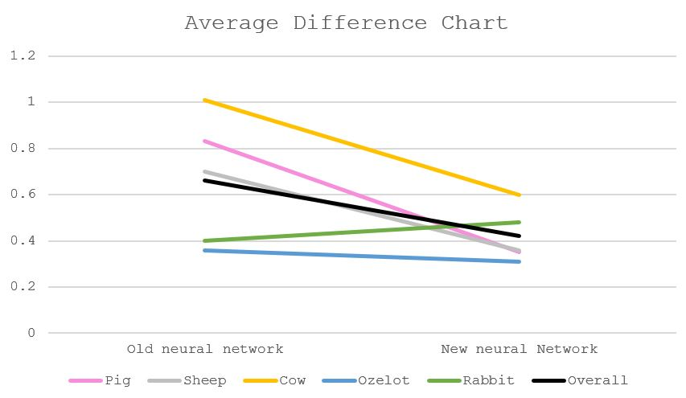
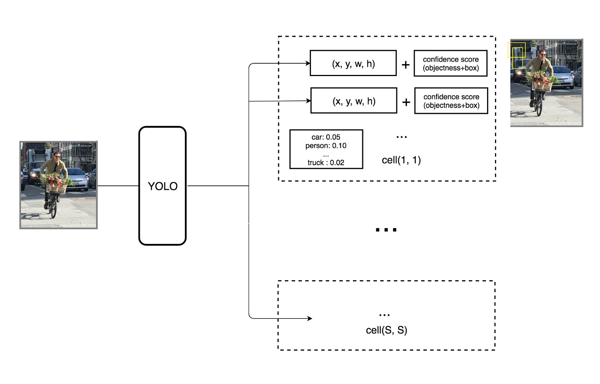

## Video
<iframe width="560" height="315" src="https://www.youtube.com/embed/nLSsMIVwrUc" frameborder="0" allow="accelerometer; autoplay; encrypted-media; gyroscope; picture-in-picture" allowfullscreen></iframe>
## Project Summary
In our Minecraft-AI project, the agent tries to recognize different animals that appear in his view such as Pig, Rabbit, Ozelot, Sheep, Cow and then attempts to attack the Pig with a bow and arrows. Since we are interested in computer vision, we will attempt to use a real-time object detection algorithm called YOLO (You Only Look Once) to detect which animals are in the agents view and where are the animals in the agent's view. Object detection can be very slow if we don't have the right approach. For instance, given an image and the objective to detect the objects in the image, one naive solution is to predict all the possible bounding box that we can draw in the image, which is very inefficient. Inorder to detect objects in real-time, we need a more sophisticated algorithm that run fast but still gives correct predictions with high accuracy.
## Approaches
Firstly, we write a program to generate the dataset, which is a set of many image captures of the agent's view. To do this, we start with designing the world, which is a piece of farmland surrounded by fences on four sides. On that piece of land, we spawn some animals (such as pigs, cows, sheeps, etc) at random locations. As the program starts, the agents takes a screenshot of his current view every 3 seconds. Malmo can give us the latest frame in the form of array of pixels. Given the array of pixels, we use image processing tools such as Pillow and opencv to convert the array of pixels into an image file and store it to our computer. Before, we trained our neural network on a dataset of about 400 screenshots and the agent performs quite well. For final submission, we decided to train our neural network on about 900 images hoping to improve the accuracy of object detection.
   
After collecting the screenshots, we use an image labeling tool, which is called labelImg to create annotation files for the screenshots. An annotation file is an additional file that tells more information about the image; for this project, the additional information is which objects are in the image and where are they in the image. labelImg allows us to draw bounding box around an object and label that object, then generate an annotation file that is necessary for training. 
   

   
We will be using a real-time object detection algorithm called YOLO (You Only Look Once) to detect the animals in the agent's view. How the object detection algorithm works is that we apply a single neural network to the full image. This network divdes the image into regions and predict bounding boxes and probabilities for each region. These bounding boxes are weighted by the predicted probabilities. The model has several advantages over classifier-based systems. It looks at the whole image at test time so its predictions are informed by global context in the image. It also makes predictions with a single network evaluation unlike systems like R-CNN which require thousands for a single image. This makes it extremely fast, more that 1000 times faster than R-CNN and 100 times faster than Fast R-CNN. [YOLO: Real-Time Object Detection](https://pjreddie.com/darknet/yolo/)
   
Darknet is an open source neural network framework written in C and CUDA. It supports both CPU and GPU computation. To carry out training and object detection, we use darkflow, which is a translation of darknet to Tensorflow. Once we are done with generating the screenshots and the annotation file, we store the screenshots and the annotation files in darkflow workspace. In addition to our own dataset, we also need YOLOv2 configuration file (with some small adjustments) and YOLOv2 weights to train. For training we use Google Colab, which supports Python notebook and many other useful machine learning tools such as opencv, Tensorflow, numpy, plus a free GPU that helps to improve training speed. After a number of interations of training, we look for a point where the loss converges and stop our training there.
   
Once we are done with training, we can use our network to detect the objects in Minecraft while the game is running. Darkflow returns image detection results in a form of json array of json object. Each json object contains the information about the label of the object, its bounding box which is specified by the coordinate of the top left corner and the coordinate of the bottom right corner, confidence level of prediction. We extract this information to find the center of the bounding box around the target object (midpoint of the 2 corner points) that we are most confident about and then move the agent's aim towards that point and then shoot an arrow at the target.
   

   
For the baseline case, we generate a world with only one animal presented in the agent's view and test to see if the agent can detect that animal. There are 5 baseline cases that we test, which are the 5 types of animals that we decide for this project. Also when there is one pig in the agent's view, we want to see if the agent can recognize the pig as his killing target and tries to attack the pig.
   
## Evaluation
[Test data and images](https://github.com/hoelyhuy/HoodRobin/tree/master/train/final_counting)
#### Formulas
The formula we used to calculate individual animal's detection accuracy is $100%-\frac{\text{|true # - detected #|}}{\text{true #}}\cdot 100$, where $\text{detected #}$ is the amount of detected specified animals in an image and $\text{true #}$ is the actual amount of specified animals.
The overall accuracy is the average of the 5 accuracies (from 5 types of animals: cows, ozelots, pigs, rabbits, sheeps) calculated.
Another measurement we did is the average difference on each animal(i.e. on average, how many animals does the detection network gets incorrectly), given by $\frac{\text{|true # - detected #|}}{\text{# of images}}$, and the overall average difference is also the average of the 5 differences.
#### Accuracy and average difference findings
   

   
In the old neural network (which we used for our status report), the overall accuracy is 45.57% (the drop in percentage compared to our status report was because we use 300 and more images to test versus 100 previously, which makes the result more accurate). The improved neural network has the overall accuracy of 61.97%, a great increase thanks to most of the animals' individual accuracies, except for the rabbits' (decreased from 49.80% to 32.88%), since many rabbits tend to stay near the fence, which has the same color as the rabbits. Another explanation is that rabbits are not labelled enough in our trained data (difficult to see with our eyes, the rabbits do not appear as much in the training images,...).
   

   
Overall, the difference between the amount of detected animals and true amount of animals in the frame is not a lot, and does not vary too much between the old network and the new network, mainly due to the small amount of animals in the frame (less than 5 of one type of animals per frame). The overall average difference of the old detection network is 0.66 (i.e. on average, detects 0.66 animals incorrectly), while the new network has a rate of 0.42, closer to 0 (or, closer to detecting perfectly). Among this, the average detection rate of cows is the highest (1.01 for the old network and 0.60 for the new network). One of the many reasons for this number is that cows tend to stay behind other animals. While they are the largest, our training data mostly highlight cows that have most of its body exposed, so detecting a cow behind some other large animals (like pigs, sheeps) will be difficult. Another reason for this is some cows stay in group, and their colors merge, so it is also difficult to say if it is one or two cows. This also applies to other animals. An example is given below:
   

   
The cow on the left is detected, while the two on the right is not (one is covered by the ozelot, and the other has the similar color to the covered one). It should also be noted that there is an undetected rabbit as well (which stays near the fence on the left), and this has been explained above.
#### How does YOLO make decisions about object detection
YOLO divides the input image into an SxS grid. For each grid cell, it predicts B boundary boxes, which are defined by the algorithm, and each box has one box confidence score. Each grid cell predicts only one object.
        
Each boundary box contains 5 elements: (x,y,w,h) and a box confidence score. The confidence score reflects how likely the box contains an object (objectness) and how accurate is the boundary box. Given that there are SxS grid cells and each grid cell predicts B boundary box, we can compute SxSxB box confidence scores. However, we only keep the boundary boxes with high box confidence score (greater than 0.25) and discard the boxes with low confidence score. The conditional class probability is the probability that the detected object belongs to a particular class (one probability per category for each cell). The class confidence score for each prediction box is computed as:
   
class confidence score = box confidence score * conditional class probability
        
The class confidence score measures the confidence on both the classification and the localization, which is where an object is located. 
 
* box confidence score = P(object) * IoU
* conditional class probability = P(class i | object)
* class confidence score = P(class i) * IoU   

Where:
* P(object) is the probability the box contains an object.
* IoU is the intersection over union between the predicted box and the ground truth.
* P(class i | object) is the probability the object belongs to class i given an object is presence.
* P(class i) is the probability the object belongs to class i.

  Before incorporating our network into the game we need to evaluate its performance. For setting up the evaluation, we generate 300 test images, run darkflow on the test data once with the model from previous submission and once with model that we just trained on a bigger size dataset (about 900 images) and compare the performances of the two models. The previous model is trained on a dataset of about 400 images, and traning is terminated after 4250 iterations. Our latest model is trained on a dataset of about 900 images, and training is terminated after 4250 iterations. 

  The metric that we use to measure performance is accuracy which is the number of correct detections over the total number of objects. The correct detections and the objects are counted manually. The overall accuracy is computed by taking the ratio of correct detections (can be from any class) to total objects. In addition to the overall accuracy, we also compute 5 class accuracies for the 5 object types (pig, cow, sheep, ozelot, rabbit), because we are interested in whether there is an improvement on detecting each of the object type. Class accuracy is computed by taking the ratio of correct detection of that class over total objects of that class; for example, the number of correctly detected pigs over total pigs.
   
## Conclusion
From this project, we get an opportunity to learn more in-depth about object real-time object detection. We learn about the real-time object detection algorithm YOLO and the math that is used behind the scene for making predictions. We get to learn the steps of doing image detection which are data generation, image labeling, training a neural network, tuning some factors to increase model's performance. We get do learn and discover the two subjects in AI/ML, computer vision and neural network, that all of us have little to none hands-on experience on. 
## References
[Image Processing](https://github.com/jennyzeng/Minecraft-AI)
  [Image Labeling software](https://github.com/tzutalin/labelImg)
  [YOLO: Real-Time Object Detection (Tensorflow)](https://github.com/thtrieu/darkflow)
  [YOLO: Real-Time Object Detection (C)](https://pjreddie.com/darknet/yolo/)
  [The mathematics behind YOLO](https://medium.com/@jonathan_hui/real-time-object-detection-with-yolo-yolov2-28b1b93e2088)
  [Project inspiration](https://www.youtube.com/watch?v=4eIBisqx9_g&t=444s)
