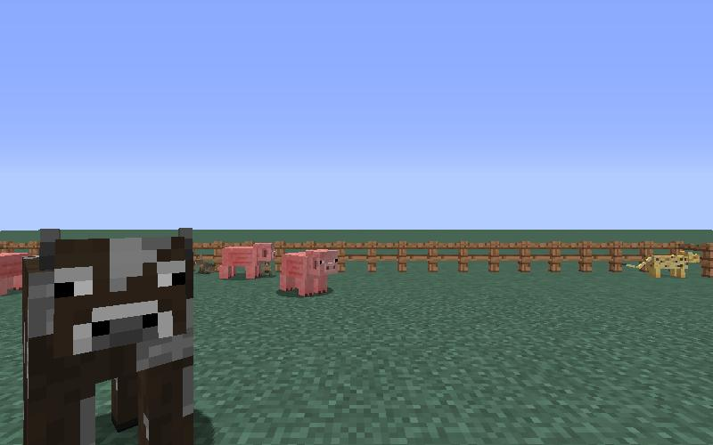
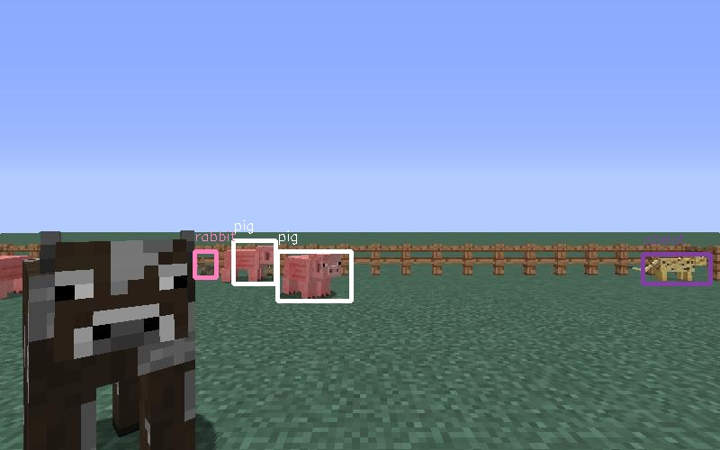

[Source code repository](https://github.com/hoelyhuy/HoodRobin)

## Reports:

- [Proposal](proposal.html)
- [Status](status.html)
- [Final](final.html)

## What is our project about?
For our project, we will use computer vision to detect objects that are currently in the view of the agent and try to atack the target object. We choose the target object to be Pigs, and our agent will try to shoot an arrow at pigs. Using an Object Detection algorithm called YOLO (You Only Look Once), we are able to detect the objects in the agents 2D view which might be Sheeps, Pigs, Cows, Rabbits, Ozelots. From that, we can detect where our target is, move our aim towards target and shoot an arrow at the target. 
Our dataset is generated from Malmo Minecraft as image files and we use an image labeling software to label those images. We will use our data (about 1300 images by time of final submission) to train our neural network for object detection. 
 
## Example
### Input

### Output

 
## YOLO: Real-Time Object Detection. What is it?
You only look once (YOLO) is a state-of-the-art, real-time object detection system. Prior detection systems repurpose classifiers or localizers to perform detection. They apply the model to an image at multiple locations and scales. High scoring regions of the image are considered detections.
 
 
YOLO uses a totally different approach. It applies a single neural network to the full image. This network divides the image into regions and predicts bounding boxes and probabilities for each region. These bounding boxes are weighted by the predicted probabilities.
 
 
The model has several advantages over classifier-based systems. It looks at the whole image at test time so its predictions are informed by global context in the image. It also makes predictions with a single network evaluation unlike systems like R-CNN which require thousands for a single image. This makes it extremely fast, more than 1000x faster than R-CNN and 100x faster than Fast R-CNN. See our paper for more details on the full system.
[Reference page](https://pjreddie.com/darknet/yolo/)
 

## Team members
Edwin Li
 
Ban Gia Tien
 
Huy Minh Brian Pham

## Resources used
[Image Capture](https://github.com/jennyzeng/Minecraft-AI)
 
[Image Labeling software](https://github.com/tzutalin/labelImg)
 
[YOLO: Real-Time Object Detection (written in Tensorflow)](https://github.com/thtrieu/darkflow)
 
[YOLO: Real-Time Object Detection (written in C)](https://pjreddie.com/darknet/yolo/)

