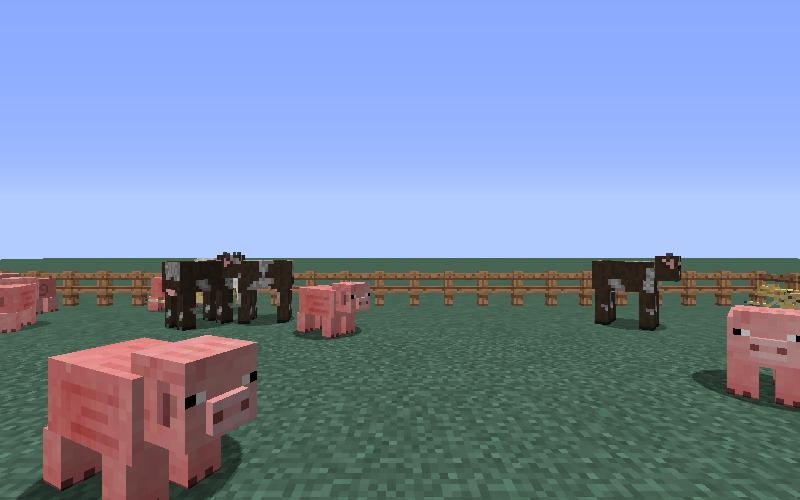
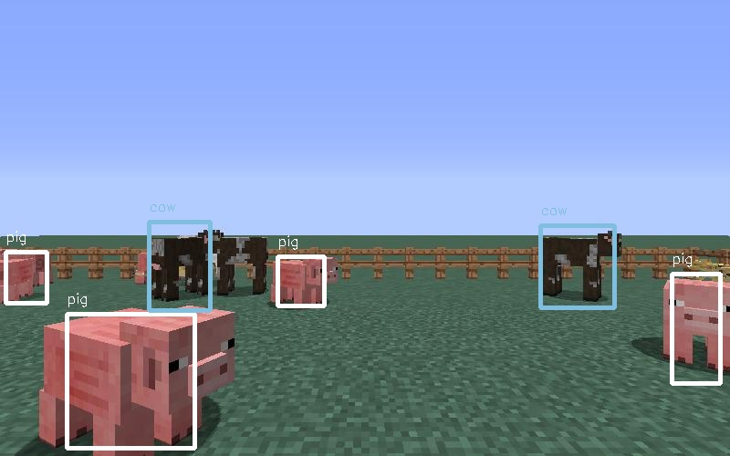

## Project Summary
Our Minecraft-AI project will focus on recognizing different characters in Minecraft such as Pig, Rabbit, Ozelot, Sheep, Cow and then try to attack the Pig. We will be using image detection to determine what animals are in the agent's view and where are they in the view. Based on the rule that we make, which is to attack Pigs, our agent will try to aim at a pig and shoot arrows at it. 
## Approach
Firstly, we write a program to generate our dataset. This program captures the agent's view every 3 seconds and store the captures in the screenshot folder. Then we label the objects in those images.
 
 
Secondly, we use all the images that we have generated and their corresponding annotations to train our neural network. An annotation file gives more information about the image such as what objects are in the image and where are those objects in the image. How the object detection algorithm works is that we apply a single neural network to the full image. This network divdes the image into regions and predict bounding boxes and probabilities for each region. These bounding boxes are weighted by the predicted probabilities. The model has several advantages over classifier-based systems. It looks at the whole image at test time so its predictions are informed by global context in the image. It also makes predictions with a single network evaluation unlike systems like R-CNN which require thousands for a single image. This makes in extremely fast, more that 1000 times faster than R-CNN and 100 times faster than Fast R-CNN. [YOLO: Real-Time Object Detection](https://pjreddie.com/darknet/yolo/)
 
 
Once we are done with training, we can use our network to detect the objects in Minecraft while the game is running. From the result of object detection, we find the location of the target animal that we are most confident about (there can be many targets on the screen and we choose the one with highest probability). Then we write a simple algorithm to move our agent's aim to the center of the bounding box of the chosen target and then shoot an arrow at that target. 
## Evaluation
Since our project mainly focus on image detection, the performance of the project is measured by how accurately our object detector detects the animals. After we finish training our dataset, we will test our model on a set of 100 images that are generated from the game. The accuracy is the number of correct detections over the total number of objects. These numbers are counted manually.
 
## Current Progress
### Input

### Output

 
From the example above, we can see that there are a total of 11 objects in the image: 3 cows, 2 ozelots, and 6 pigs. Our object detector is able to correctly detect 6 objects.
## Remaining Goals and Challenges
For the remaining 2-3 weeks, we will try to improve the accuracy of our detector by training our neural network on a larger size dataset. At present, our network is trained on 400 images and has decent performance. We shoot for over 1000 images in our training dataset.
 
 
Another thing that we need to do is improving the algorithm to aim at a target object. Right now our agent can aim at the target quite well sometimes, but sometimes the agent's aiming is a bit off. 
 
 
Some limitations that we can think of are the overhead to load the agent's current view image into our neural network and the time to process the image. The total time to load and process an image is about a couple seconds. This is a bit slow for a real time application like our project, since our target might have walked away once we finish processing the previous frame. If we had a GPU we would be able to process image a lot faster and we might be able to solve the problem.
## Resources Used
[Image Capture](https://github.com/jennyzeng/Minecraft-AI)
 
[Image Labeling software](https://github.com/tzutalin/labelImg)
 
[YOLO: Real-Time Object Detection (Tensorflow)](https://github.com/thtrieu/darkflow)
 
[YOLO: Real-Time Object Detection (C)](https://pjreddie.com/darknet/yolo/) 

